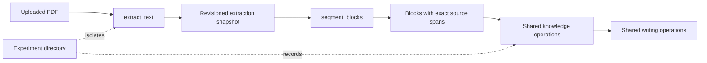
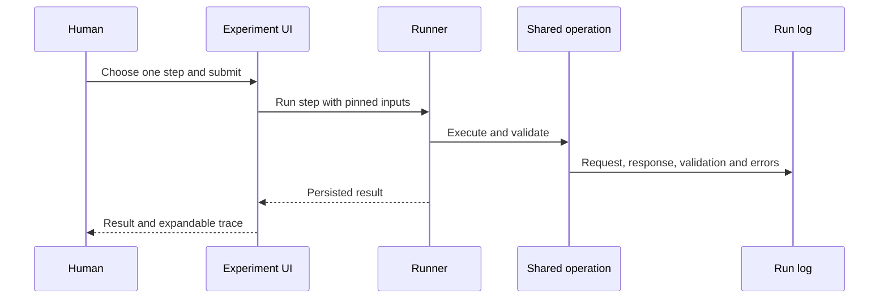
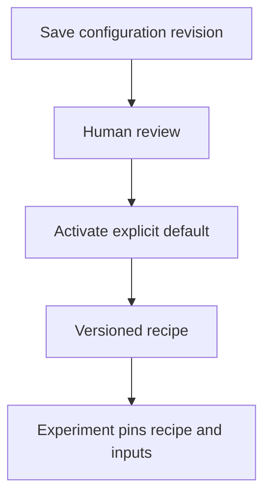

# Knowledge Server

I'm building this as my personal workshop for reading, thinking and writing.
The idea is to turn a growing pile of papers into a smaller, better-connected
body of knowledge: claims I can inspect, notes I can reuse, and arguments that
still know where their evidence came from. A Zettelkasten with a database and
receipts, if you like.

> [!IMPORTANT]
> This is a personal project under active, frequent development. Expect breaking
> changes to commands, schemas and workflows. It is not a stable public service
> or a supported end-user product. This README is for me and the people and
> agents working on it with me.

## Where things stand

The application already has revisioned claims and evidence, human review,
Zotero-backed PDF access, import reconciliation, note consolidation and a plain
HTML interface. Docling/Marker extraction, background jobs and structured source
views exist, but their integration and corpus acceptance are unfinished.

The central quality question is still open: does a new source actually improve
an existing note? The [consolidation pilot](docs/knowledge-consolidation-test.md)
did not demonstrate that reliably. Valid JSON and working citations are useful;
they are not a substitute for useful synthesis.

The first priority is an **isolated experimentation dashboard**: run a PDF
through the real workflow, inspect every intermediate result, compare prompts
and processing choices, then discard the test environment. The first shared
runner connects eight manually started steps, from PDF extraction through
source-grounded blocks and knowledge proposals to cited prose. Attempts retain
their inputs and configuration; a separate view compares step variants.
Step 1 includes Crossref source matching and a literature view with observed
citation contexts across experiments.
This is working development tooling, not accepted synthesis quality. The tooling
deserves as much attention as the application code. See [#1][issue-1] and the
[workbench guide](docs/experimentation-workbench.md) for boundaries and evidence.

## Working model

| Responsibility | Owner |
| --- | --- |
| Literature metadata, PDFs and reading workspace | Zotero |
| Claims, evidence, assessments, notes and immutable revisions | PostgreSQL |
| Document content and extraction issues | Versioned extraction snapshots |
| Bounded model proposals | Hermes |
| Reading, editing and review | Shared Python operations, CLI and HTML views |
| Markdown/HTML exports and search indexes | Derived from canonical records |

Zotero note and annotation integration is still being completed. Personal PDF
sync through [our own WebDAV storage](docs/knowledge-webdav-sync.md), including
an iPad workflow, is the agreed target; deployment and migration are pending.

Keep exact quotations and historical references intact through every change.
Human review, extraction quality and processing success are separate things.
Ordinary reads do not need a model. Private papers, model logs, credentials and
runtime state stay outside Git.

## Start here when developing

Read [AGENTS.md](AGENTS.md), [CONTRIBUTING.md](CONTRIBUTING.md) and the
[documentation guide](docs/README.md) before changing behavior. The guide
separates implemented contracts, approved requirements and historical ideas.
An architecture diagram is not a deployment report.

Pick a bounded [issue](https://github.com/dweigend/knowledge-server/issues),
check the existing implementation and reuse its operations. Preserve revision
and retry guarantees, include relevant verification in the PR, and update the
implementation status when a feature actually works.

### Minimal local setup

Use Python 3.13+, uv, PostgreSQL and Zotero Desktop with its local API enabled.
PDF processing also needs Poppler. Workbench document analysis uses a separate
GROBID service; see
[service setup](deploy/README.md#optional-scientific-pdf-service).
Configure a development database and a separate test database, then:

```sh
uv sync --locked
cp .env.example .env
# Configure .env for your local databases, Zotero and runtime paths.
set -a
. ./.env
set +a
mkdir -p "$KNOWLEDGE_ARCHIVE_ROOT"
uv run knowledge init
uv run uvicorn knowledge.web:create_app --factory --host 127.0.0.1 --port 8765
```

The HTML app has no login: keep it on loopback and use an SSH tunnel for remote
access. Run `uv run knowledge --help` for commands. Model workflows require a
separate Hermes installation; the current adapter uses `gpt-5.6-luna` through
`openai-codex`. See [deployment](deploy/README.md) for Linux extraction runtimes
and backup requirements. The disposable experiment dashboard is available at
`/experiments`. It stores private run data beside the archive, advances one
step at a time, never calls a model while reading, and can delete a run on
request. Open the server URL, not the Jinja template as a local file.
`uv run knowledge-experiment --help` exposes the same runner for scripts.

### Shared execution boundaries

The experiment runner calls the same extraction, validation and model adapter
functions as the normal application. It owns only temporary inputs, outputs
and logs.



Every column is a manually started operation. The dashboard reads pinned JSON
and JSONL files; it does not start follow-up work implicitly.
Source references are checked structurally. Model usefulness, accurate synthesis
and personal writing style still need human evaluation.



Prompt and recipe revisions live in the private configuration registry. Saving a
revision and activating a default are separate operations; an experiment pins
the revision it actually used.



### Checks

```sh
uv run --locked ruff check .
uv run --locked ruff format --check .
uv run --locked ty check --exclude src/knowledge/hermes_bridge.py
uv run --locked pytest
```

Set `KNOWLEDGE_TEST_DATABASE_URL` to the isolated test database before pytest.
[CI](.github/workflows/checks.yml) also checks packaging and Markdown.
Live Hermes calls, real OCR quality and deployment acceptance need their own
bounded checks; the unit suite does not establish them.

## License

Original code is [MIT](LICENSE). Bundled PDF.js and optional extraction tools
retain their own terms; see [third-party notices](THIRD_PARTY_NOTICES.md).

## Development checklist

Start with the experimentation foundation, then use it to develop and verify
new behavior. These boxes track delivery, not just code being present; the
linked issues contain acceptance criteria and dependencies.

- [ ] **First:** build the isolated experimentation dashboard ([#1][issue-1]).
- [ ] Establish a reproducible document corpus ([#2][issue-2]) and demonstrate
  a useful new-source-to-note contribution ([#19][issue-19]).
- [ ] Replace technical Zotero tags with durable import mappings
  ([#8][issue-8]) and inventory clients and attachments before migration
  ([#13][issue-13]).
- [ ] Validate extraction, document relationships and Linux operation
  ([#3][issue-3], [#4][issue-4], [#6][issue-6]).
- [ ] Move knowledge ingestion to structured snapshots ([#5][issue-5]).
- [ ] Complete Zotero metadata, summaries and annotation reading
  ([#9][issue-9], [#10][issue-10], [#11][issue-11], [#12][issue-12]).
- [ ] Set up WebDAV, verify all clients and prove recovery
  ([#14][issue-14], [#15][issue-15], [#18][issue-18]).
- [ ] Connect resumable annotation intake to evidence proposals
  ([#16][issue-16], [#17][issue-17]).
- [ ] Complete source-view acceptance and the verified corpus migration ([#7][issue-7]).
- [ ] Add research context, structured scope and consistent claim views
  ([#20][issue-20], [#21][issue-21], [#22][issue-22]).
- [ ] Improve bounded retrieval, evaluate author rules and complete proposal review
  ([#23][issue-23], [#24][issue-24], [#25][issue-25]).
- [ ] Connect both intake paths through observable, resumable operations
  ([#26][issue-26], [#27][issue-27], [#28][issue-28], [#29][issue-29]).

Discovery, graphs, embeddings, portable history, additional clients and inputs,
research integration and publication are tracked in the
[future backlog](https://github.com/dweigend/knowledge-server/issues?q=is%3Aissue%20is%3Aopen%20label%3Abacklog).
They will be split into implementation tasks when selected. Podcast production
belongs in a separate project.

[issue-1]: https://github.com/dweigend/knowledge-server/issues/1
[issue-2]: https://github.com/dweigend/knowledge-server/issues/2
[issue-3]: https://github.com/dweigend/knowledge-server/issues/3
[issue-4]: https://github.com/dweigend/knowledge-server/issues/4
[issue-5]: https://github.com/dweigend/knowledge-server/issues/5
[issue-6]: https://github.com/dweigend/knowledge-server/issues/6
[issue-7]: https://github.com/dweigend/knowledge-server/issues/7
[issue-8]: https://github.com/dweigend/knowledge-server/issues/8
[issue-9]: https://github.com/dweigend/knowledge-server/issues/9
[issue-10]: https://github.com/dweigend/knowledge-server/issues/10
[issue-11]: https://github.com/dweigend/knowledge-server/issues/11
[issue-12]: https://github.com/dweigend/knowledge-server/issues/12
[issue-13]: https://github.com/dweigend/knowledge-server/issues/13
[issue-14]: https://github.com/dweigend/knowledge-server/issues/14
[issue-15]: https://github.com/dweigend/knowledge-server/issues/15
[issue-16]: https://github.com/dweigend/knowledge-server/issues/16
[issue-17]: https://github.com/dweigend/knowledge-server/issues/17
[issue-18]: https://github.com/dweigend/knowledge-server/issues/18
[issue-19]: https://github.com/dweigend/knowledge-server/issues/19
[issue-20]: https://github.com/dweigend/knowledge-server/issues/20
[issue-21]: https://github.com/dweigend/knowledge-server/issues/21
[issue-22]: https://github.com/dweigend/knowledge-server/issues/22
[issue-23]: https://github.com/dweigend/knowledge-server/issues/23
[issue-24]: https://github.com/dweigend/knowledge-server/issues/24
[issue-25]: https://github.com/dweigend/knowledge-server/issues/25
[issue-26]: https://github.com/dweigend/knowledge-server/issues/26
[issue-27]: https://github.com/dweigend/knowledge-server/issues/27
[issue-28]: https://github.com/dweigend/knowledge-server/issues/28
[issue-29]: https://github.com/dweigend/knowledge-server/issues/29
