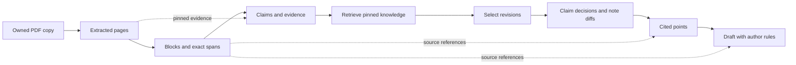
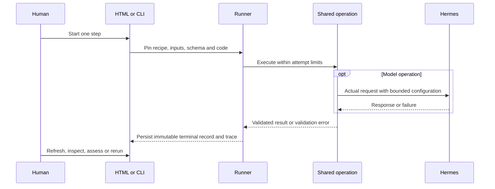
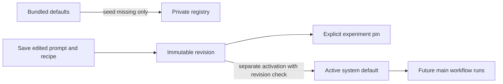

# Experimentation workbench

The workbench is development tooling for [issue #1](https://github.com/dweigend/knowledge-server/issues/1).
Upload a PDF, start one operation, inspect its result, adjust a saved recipe and
compare attempts. Ordinary reads never start model work. The HTML interface is
served by FastAPI at `/experiments`; opening a template with `file://` cannot
render the application.

## Shared operations and boundaries

| Step | Shared operation |
| --- | --- |
| PDF text | `ingestion.extract_pdf_pages` |
| Information blocks | `information_blocks` |
| Claims and evidence | `import_workflow.extract_document` |
| Find knowledge | `knowledge_selection.retrieve_knowledge` |
| Select entries | `knowledge_selection` |
| Propose changes | `reconciliation` and `consolidation` |
| Cited points | `writing` |
| Write prose | `writing` |

Extraction records Poppler pages and source revisions, including readable short
PDFs. Segmentation offers model and deterministic paragraph modes, both with
exact spans. Selection retains inclusion/exclusion rationale and retrieved
revisions; proposed changes use existing claim and note contracts. Writing
retains block citations and requires explicit author rules for prose.

`pipeline_steps.py` assembles these functions and validates typed step results.
`experimentation.py` owns attempt lifecycle, dependency resolution and reviews;
`experiment_store.py` owns private files, locks and hashes. `experiment_web.py`
and `experiment_cli.py` are entry points to the same runner. `generation.py`
and `hermes_bridge.py` remain the model/runtime boundary. No second agent loop
or production-acceptance path exists in the workbench.

Each arrow describes an input dependency, not automatic scheduling. The runner
uses explicit dependency pins and rejects mixed upstream lineages. Existing
knowledge is a reviewed JSON snapshot of complete `Record` revisions; an empty
snapshot is valid and visible. The runner does not accept generated proposals
into PostgreSQL or write to personal Zotero.

## Manual execution and inspection

1. Add one or more PDFs and optionally a pinned starting-knowledge snapshot.
2. Select a source and save/run its next step. Adjust instructions and model
   settings directly; advanced controls contain validated step parameters.
3. Refresh results. Inspect exact inputs, schema, requests, responses and
   validation failures in the attempt inspector.
4. Use **Compare** to rerun one step on selected baselines. Each source keeps
   its original input attempt IDs; selected sources must share starting knowledge.
5. Record usefulness, source faithfulness and tone separately from structural
   validation. Export an intentionally retained report before deleting a source.

Only one attempt may be active for a source. A successful upstream rerun makes
dependent results stale without overwriting them. Failed reruns preserve the
last successful lineage. Cancellation records intent and stops bounded work;
recovery marks abandoned attempts so a fresh manual attempt can be prepared.
It does not pretend to resume an interrupted provider request.

The adapter supports tool-free Hermes requests. Unsupported tools and monetary
caps are rejected; there are no decorative controls that silently ignore them.
Request limits and a total step time limit apply. Effective model/provider are
recorded when reported by Hermes; unknown values remain unknown. Cache hits and
validation repair attempts are explicit. Traces contain observable requests and
responses, never hidden reasoning or raw provider diagnostics.

## Configuration and retention

Bundled prompt files seed missing configuration once. The private versioned
registry is the editable runtime authority afterwards. Recipes pin prompt,
author-rule and output-schema revisions together with model and step parameters.
Main import/reconciliation/consolidation defaults resolve through this registry.

Saving does not activate. Activation does not approve generated knowledge and
does not alter historical attempts. Author rules require the author's supplied
instructions/examples; the application does not invent a personal voice.

Private run directories live beside the archive under `experiments/`. Source
copies, knowledge snapshots, attempt inputs, outputs and traces belong to the
experiment. Saved configurations live in `KNOWLEDGE_CONFIGURATION_ROOT` (or the
private default configuration path) and survive deletion. Explicit report files
written outside the run directory also survive. Cleanup only removes owned
files, records partial failure separately and permits retry. Legacy first-slice
runs can be exported/deleted; recreate a source to use immutable attempts.

Attempt records pin source, knowledge and input hashes, recipe/prompt/rules,
output schema, Git commit and dirty source hash. The runner rejects disk code
changes when they no longer match the loaded process; restart the development
server before preparing a new attempt. After a server restart, reload browser
forms to obtain a fresh form token.

## Verification and remaining work

Automated coverage includes exact spans, tampered inputs/results, coherent
dependency lineage, stale propagation, actual subprocess cancellation/timeouts,
recovery, cleanup retries, optimistic configuration/review revisions, form
protection and shared main/workbench domain calls. Database tests require the
isolated test database described in `AGENTS.md`; fixtures isolate the private
configuration registry too. Model test doubles validate integration, not quality.

The September 2026 browser check uploaded the public *Attention Is All You Need*
PDF, extracted all 15 pages with Poppler and ran deterministic paragraph blocks.
This demonstrates a real source/manual UI path, not corpus-wide accuracy.

A separate bounded Hermes check used the first page of that public PDF as an
explicit source derivative in private temporary storage. All eight stages
completed with deterministic paragraph segmentation, an empty knowledge snapshot
and neutral test author rules. The first semantic segmentation design failed
twice because the model guessed character offsets. The revised scaffolding asks
for exact page/quote selections and resolves unique offsets deterministically;
it produced three blocks with five valid source spans on its first live attempt.
Seven actual model responses were used in total, with effective
`gpt-5.6-luna` / `openai-codex` recorded. Failed and successful attempts remain in
the private exported verification report. This does not evaluate the author's
voice, populated-corpus selection, or useful canonical note acceptance.

The final rebuild checks passed 225 tests, Ruff lint/format, ty (with the
repository's Hermes bridge exclusion), Markdown lint and source/wheel packaging.

Current limitations remain deliberate and visible:

- Structured scope migration belongs to #21; existing text scope is preserved.
- Claim extraction retains the existing one-claim-per-chunk contract.
- Note diffs use existing note context. Acceptance of new source evidence into
  canonical notes and demonstration of useful synthesis remain #19/#25 work.
- Retrieval is bounded lexical matching, not a validated semantic index (#23).
- Exact references establish source association, not factual entailment.
- OCR/layout acceptance and structured-ingestion cutover remain #3–#7 work.
- Exported reports and independent test fixtures are available. A UI for saved
  regression cases with reviewed expectations and portable replay is still open.
- Agent tool execution and monetary budget enforcement need actual adapter
  support before they can be enabled.
- There is no durable background job service here. Recovery of an interrupted
  web process is explicit and manual.

Issue #1 remains open for those acceptance gaps. Neither eight connected cards
nor a green test suite establishes the complete knowledge system's quality.
