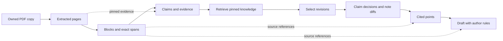
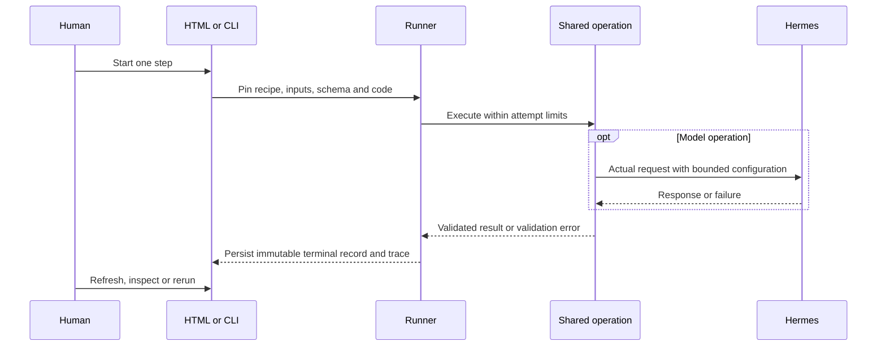
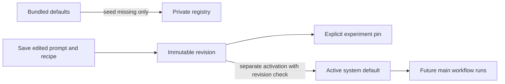

# Experimentation workbench

The workbench is development tooling for [issue #1](https://github.com/dweigend/knowledge-server/issues/1).
Upload a PDF, start one operation, inspect its result, adjust a saved recipe and
compare attempts. Ordinary reads never start model work. The HTML interface is
served by FastAPI at `/experiments`; opening a template with `file://` cannot
render the application.

## Document extraction

Step 1 supports GROBID document analysis and an explicit Poppler-only baseline.
New registries start with GROBID and fallback literature discovery. Existing
recipes remain immutable; saving the step creates an `extraction.v4` recipe.
Old results stay readable, and downstream
results become stale only after a successful rerun.

Discovery runs can also report a bibliography recovery audit: the original
analyzer count, independently detected text entries, retained entries, model
status and unresolved issues. Recovered counts are evidence for manual review,
not a guarantee that every reference or citation target is correct.

The UI shows continuous document content, without individual page panels.
GROBID processes the complete PDF and returns original document structure as
Markdown, paper metadata, bibliography entries and citation-target mappings.
Missing fields and unresolved references stay visible. This is document
conversion, not a semantic summary or a completeness guarantee. Original Poppler
page text and its revision remain the authority for exact quotation validation;
GROBID's normalized Markdown is a separate representation. Information blocks
can use that structure as context but must cite the original page text.

The boundary is split into `literature/structured_paper_models.py`
(provider-neutral results), `literature/grobid_client.py` (HTTP and cancellation),
`literature/grobid_parser.py` (TEI conversion),
`source_workflows/structured_paper_extraction.py` (shared orchestration) and
`web_interface/paper_markdown_renderer.py` (safe rendering).
An analyzer with the same callable contract can replace GROBID without changing
source-span validation or UI contracts. The original provider response and
Markdown are retained in the attempt's private trace directory; the export
contains the normalized paper result. The exact-text revision identifies only
the Poppler text; the attempt output hash covers the enriched result as well.

Configure `KNOWLEDGE_GROBID_URL` before creating a new registry, or set the service
URL in the step form. The selected URL is pinned in each recipe. See
[service setup](../deploy/README.md#optional-scientific-pdf-service).
Extraction failure fails the attempt rather than silently substituting raw-text
success. The HTTP client honors cancellation and the overall step deadline;
remote computation
may continue after its connection is closed.
GROBID consolidation is disabled. A separate Crossref adapter now reconciles
paper metadata and bibliography when `literature_provider` is `crossref` or
`discovery`. Discovery adds bounded fallback searches after this first pass.
Only bibliographic fields and identifiers are sent to Crossref;
PDF content and citation contexts stay in the private experiment. Reads contact
neither service.

A live check with the CPU GROBID 0.9.1 service processed a complete public paper
and returned 40 bibliography records and 58 linked citation markers. A German
book chapter also completed, but exposed author/editor confusion, missing
metadata, incomplete bibliography detection and reading-order problems. These
are visible provider-quality limitations, not accepted extraction accuracy.
Markdown and the original PDF remain available for comparison.

## Literature records and citation network

Each enriched extraction contains one normalized record per confidently
identified work, including the uploaded paper itself.
`literature/literature_models.py` defines bibliographic metadata, resolution
provenance and observed citations. `literature/crossref_client.py` owns network
access; `literature/literature_resolution.py` owns matching and deduplication.
External candidates and original extraction remain available alongside the
accepted metadata. Missing fields are explicit.

An exact DOI still requires compatible title evidence. Bibliographic searches
require strong title, author and publication-year agreement. Ambiguous matches
and service errors never become confirmed work identities. Repeated citations
retain separate occurrence indexes, context excerpts, section headings and
available PDF coordinates. Unknown citation targets and duplicate bibliography
identifiers remain document-scoped review records rather than guessed edges.
Context describes the source's wording; no support/criticism label is inferred.

The Literature view groups records by stable identity across the latest
successful extraction of each current experiment. Its JSON export includes work
records, document hashes, attempt IDs and directed citation observations.
Historical attempts retain their own metadata snapshots. Removing an experiment
also removes its observations from this view; nothing is silently accepted into
the permanent knowledge database. The reusable contracts provide the foundation
for that later integration without a separate persistent graph database.

In Crossref-only mode, requests are sequential, cached within the run, individually bounded to
15 seconds and subject to the overall step budget. HTTP 429 stops further lookup
requests in that run. A failed lookup remains visible on its source record.
Crossref coverage and GROBID reference extraction are incomplete, particularly
for older books: the interface does not claim all records are complete simply
because execution finished.

## Fallback discovery

Select **Crossref + fallback discovery** to search additional catalogs when the
initial resolution is unmatched, ambiguous or failed, or required metadata remains
missing. The default required fields are title, authors and year. A successful
Crossref match with those fields does not need another search. Additional
catalogs do not replace PDF evidence or prove bibliography completeness.
When a citation has a checksum-validated ISBN and no valid DOI, discovery tries
a direct book-catalog lookup first. ISBN-10 and ISBN-13 identify the same edition
after normalization; conflicting editions remain unresolved.

`source_workflows/reference_discovery.py` is the callable workflow boundary;
provider clients, grounded bibliography recovery and persistent search caching
remain separate modules. Discovery preserves the exact PDF text revision.
The completeness audit recognizes author/year and numbered bibliographies with
explicit headings. Unrecognized layouts remain a review issue rather than a
claim of complete extraction. Recovered references retain exact page spans;
ambiguous citation targets stay unresolved.

New extraction recipes use low reasoning effort for bounded metadata parsing.
The existing Hermes runtime is required only when model assistance is needed;
configure `KNOWLEDGE_HERMES_PYTHON` on the machine running the worker. Missing
runtimes and timed-out model requests remain visible and cached, while grounded
extraction and catalog results are retained. No model or network request runs
when viewing an existing result.

Advanced controls pin the provider order, request budgets, model-call budget,
model timeout, required fields and search revision in the recipe. Defaults are
DNB, OpenAlex and Open Library; Semantic Scholar and Google Books are optional.
Optional credentials are listed in `.env.example`. Open-access lookup is opt-in;
Unpaywall requires a contact email. Credentials are environment settings, never
part of recipes or exported search traces.

The default fallback limits are 40 requests per run, 5 per reference and 2 model
calls, with a 60-second model timeout. The overall step deadline still applies.
Model assistance may propose bounded search queries; candidates must pass the
bibliographic identity checks before becoming confirmed records. Neither a model
response nor an open-access URL is sufficient evidence for an identity.

Search results are cached within the source experiment, including unsuccessful
searches, so an ordinary rerun does not repeat unchanged failed queries
indefinitely. Increase **Search revision**
to explicitly retry negative cache entries. Confirmed complete references and
successful bibliography recovery remain cached across search revisions.
Changing budgets alone does not clear negative entries.
The result shows request, cache-hit and model-call totals, warnings
and a collapsed per-reference trace of provider, query, status and candidate count.
Reading a result never starts another search. Provider failures and exhausted
budgets remain visible; unresolved sources are retained for review.

Existing saved recipes are not rewritten or activated automatically. Saving a
legacy recipe creates a new `extraction.v4` revision; historical outputs without
discovery reports remain readable. Selecting Crossref-only or extraction-only
keeps the saved discovery settings available for a later run.

## Shared operations and boundaries

| Step | Shared operation |
| --- | --- |
| PDF text | `structured_paper_extraction.extract_paper_document` |
| Information blocks | `information_block_extraction.segment_information` |
| Claims and evidence | `article_claim_extraction.extract_document` |
| Find knowledge | `knowledge_candidate_selection.retrieve_knowledge` |
| Select entries | `knowledge_candidate_selection.select_knowledge` |
| Propose changes | `claim_matching` and `note_revision_proposals` |
| Cited points | `source_grounded_writing` |
| Write prose | `source_grounded_writing` |

Extraction records Poppler pages and source revisions, including readable short
PDFs. Segmentation offers model and deterministic paragraph modes, both with
exact spans. Paragraph mode is a literal technical baseline: it ignores the
model prompt and splits text at paragraphs and the configured character limit.
It does not identify logical units or filter page numbers, running headers and
other document furniture. These outputs are not semantic information blocks.
Selection retains inclusion/exclusion rationale and retrieved
revisions; proposed changes use existing claim and note contracts. Writing
retains block citations and requires explicit author rules for prose.

`experiments/experiment_step_catalog.py` declares every step once, while the
focused modules below `experiments/experiment_steps/` validate and execute
typed results. `experiments/experiment_runner.py` owns attempt lifecycle and
dependency resolution; `experiments/experiment_store.py` owns private files,
locks and hashes. `web_interface/experiment_routes.py` and
`command_interfaces/experiment_cli.py` are entry points to the same runner.
`model_integration/structured_generation.py` and
`model_integration/hermes_bridge.py` remain the model/runtime boundary. No
second agent loop or production-acceptance path exists in the workbench.

Each arrow describes an input dependency, not automatic scheduling. The runner
uses explicit dependency pins and rejects mixed upstream lineages. Existing
knowledge is a reviewed JSON snapshot of complete `Record` revisions; an empty
snapshot is valid and visible. The runner does not accept generated proposals
into PostgreSQL or write to personal Zotero.

## Manual execution and inspection

1. Add one or more PDFs and optionally a pinned starting-knowledge snapshot.
2. Select a source and save/run its next step. Adjust instructions and model
   settings directly; advanced controls contain validated step parameters.
3. Refresh results. Inspect exact inputs, schema, requests, responses and
   validation failures in the attempt inspector.
4. Use **Compare** to rerun one step on selected baselines. Each source keeps
   its original input attempt IDs; selected sources must share starting knowledge.
5. Record usefulness, source faithfulness and tone separately from structural
   validation. Export an intentionally retained report before deleting a source.

Only one attempt may be active for a source. A successful upstream rerun makes
dependent results stale without overwriting them. Failed reruns preserve the
last successful lineage. Cancellation records intent and stops bounded work;
recovery marks abandoned attempts so a fresh manual attempt can be prepared.
It does not pretend to resume an interrupted provider request.

The adapter supports tool-free Hermes requests. Unsupported tools and monetary
caps are rejected; there are no decorative controls that silently ignore them.
Request limits and a total step time limit apply. Effective model/provider are
recorded when reported by Hermes; unknown values remain unknown. Cache hits and
validation repair attempts are explicit. Traces contain observable requests and
responses, never hidden reasoning or raw provider diagnostics.

## Configuration and retention

Bundled prompt files seed missing configuration once. The private versioned
registry is the editable runtime authority afterwards. Recipes pin prompt,
author-rule and output-schema revisions together with model and step parameters.
Main import/reconciliation/consolidation defaults resolve through this registry.

Saving does not activate. Activation does not approve generated knowledge and
does not alter historical attempts. Author rules require the author's supplied
instructions/examples; the application does not invent a personal voice.

Private run directories live beside the archive under `experiments/`. Source
copies, knowledge snapshots, attempt inputs, outputs and traces belong to the
experiment. Saved configurations live in `KNOWLEDGE_CONFIGURATION_ROOT` (or the
private default configuration path) and survive deletion. Explicit report files
written outside the run directory also survive. Cleanup directly removes the
owned experiment directory. Runs from older manifest formats are omitted from
the workbench.

The MVP has no human-rating form or review API. Earlier private review files
remain untouched until their experiment is deleted; new attempt views and
exports omit them. Previously exported reports remain unchanged.

Attempt records pin source, knowledge and input hashes, recipe/prompt/rules,
output schema, Git commit and dirty source hash. The runner rejects disk code
changes when they no longer match the loaded process; restart the development
server before preparing a new attempt. After a server restart, reload browser
forms to obtain a fresh form token.

## Verification and remaining work

Automated coverage includes exact spans, tampered inputs/results, coherent
dependency lineage, stale propagation, actual subprocess cancellation/timeouts,
recovery, isolated cleanup, optimistic configuration revisions, form
protection and shared main/workbench domain calls. Database tests require the
isolated test database described in `AGENTS.md`; fixtures isolate the private
configuration registry too. Model test doubles validate integration, not quality.

The September 2026 browser check uploaded the public *Attention Is All You Need*
PDF, extracted all 15 pages with Poppler and ran deterministic paragraph blocks.
This demonstrates a real source/manual UI path, not corpus-wide accuracy.

A separate bounded Hermes check used the first page of that public PDF as an
explicit source derivative in private temporary storage. All eight stages
completed with deterministic paragraph segmentation, an empty knowledge snapshot
and neutral test author rules. The first semantic segmentation design failed
twice because the model guessed character offsets. The revised scaffolding asks
for exact page/quote selections and resolves unique offsets deterministically;
it produced three blocks with five valid source spans on its first live attempt.
Seven actual model responses were used in total, with effective
`gpt-5.6-luna` / `openai-codex` recorded. Failed and successful attempts remain
in the private exported verification report. This does not evaluate the author's
voice, populated-corpus selection, or useful canonical note acceptance.

The final rebuild checks passed 225 tests, Ruff lint/format, ty (with the
repository's Hermes bridge exclusion), Markdown lint and source/wheel packaging.

Current limitations remain deliberate and visible:

- Structured scope migration belongs to #21; existing text scope is preserved.
- Claim extraction retains the existing one-claim-per-chunk contract.
- Note diffs use existing note context. Acceptance of new source evidence into
  canonical notes and demonstration of useful synthesis remain #19/#25 work.
- Retrieval is bounded lexical matching, not a validated semantic index (#23).
- Exact references establish source association, not factual entailment.
- OCR/layout acceptance and structured-ingestion cutover remain #3–#7 work.
- Exported reports and independent test fixtures are available. A UI for saved
  regression cases with reviewed expectations and portable replay is still open.
- Agent tool execution and monetary budget enforcement need actual adapter
  support before they can be enabled.
- There is no durable background job service here. Recovery of an interrupted
  web process is explicit and manual.

Issue #1 remains open for those acceptance gaps. Neither eight connected cards
nor a green test suite establishes the complete knowledge system's quality.
