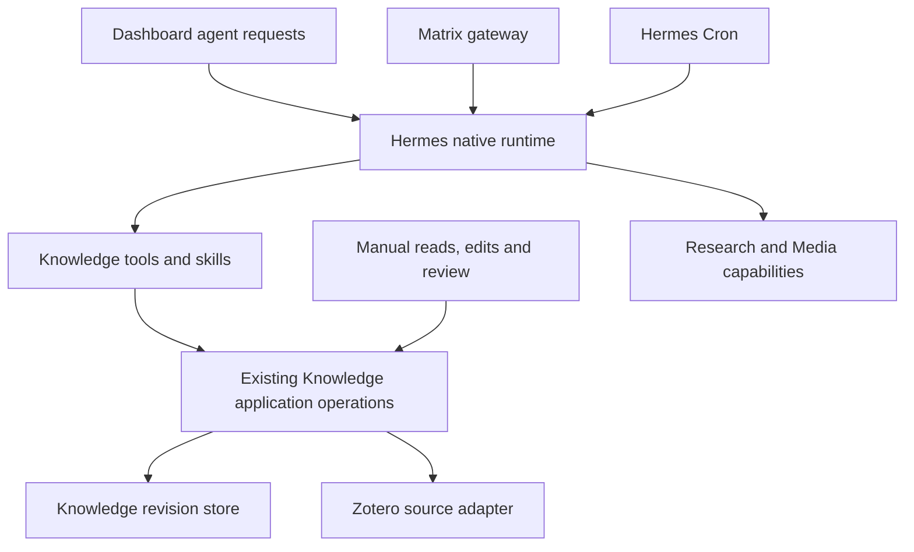

# Hermes integration target

Decision date: 2026-09-16. Status: target architecture requested by the owner;
no plugin, API integration, deployment or runtime migration is implemented by
this document. This is the authority for Hermes integration where older concept
or module documents imply a separate general task runtime or plugin framework.
Knowledge domain contracts and source/extraction specifications still apply.

## Ownership and reuse

Hermes is the common agent host: model/provider authentication, agent execution,
sessions, tools, skills, general tasks and recurring agent work belong there.
Reuse its native mechanisms before adding application infrastructure. A logical
Task Service means a narrow integration boundary over Hermes, not another
planner, scheduler, session store or general task queue.

| Responsibility | Target owner |
| --- | --- |
| Agent runs, interaction, execution approval and operational memory | Hermes |
| General tasks and recurring work | Hermes Kanban and Cron, once verified |
| Claims, evidence, notes, review and immutable revisions | Knowledge |
| Extraction snapshots and resumable document processing | Knowledge |
| Literature metadata and original PDFs | Zotero |
| Personal capture, presentation and magazine editions | Dashboard |
| Transcription and narration | Media capabilities, separate from Knowledge |

These are responsibility boundaries, not a requirement for a service per row.
Hermes can invoke the domain capabilities without owning their tables. Its
memory is not the canonical knowledge store. Tool execution approval does not
approve a scientific claim or release a magazine edition.

## Native mechanisms to integrate

The upstream documentation was inspected on 2026-09-16. Its advertised features
are candidates for reuse, not evidence about the installed server revision.

- [Runs API][runs]: use native run creation, status/events, stop and execution
  approvals. Probe `/v1/capabilities` and map supported behavior in the client.
  Native idempotency should handle run submission; Knowledge retains its own
  atomic command receipts because run acceptance is not a knowledge commit.
- [Kanban][kanban]: prefer the native persistent board for durable general work,
  dependencies and review. Its documented single-host scope must match the
  deployment. A board task and an individual execution are different identities.
- [Cron][cron]: reuse native schedules and execution history for recurring agent
  workflows. Do not add a second research scheduler inside Knowledge.
- [Plugins][plugins]: expose project tools through the supported general plugin
  mechanism and bundle skills with them. Do not build a Knowledge plugin loader
  or modify Hermes core just to register project-specific capabilities.
- [MCP][mcp]: use this as an alternative tool transport when remote placement or
  multiple consumers justify it. Do not build parallel plugin and MCP wrappers
  for the same operations in the first integration.

A run can stop or expire without erasing a durable task. Persisted definitions,
crash recovery and resuming an interrupted model/tool operation are distinct
capabilities. Verify retention, restart behavior, cooperative cancellation and
endpoint authentication on the selected version. Usage accounting is not a
proven hard monetary budget; document any missing enforcement before enabling
budget-dependent automation.

## Thin Knowledge plugin

The preferred first connection on a shared host is a general Hermes plugin:
`plugin.yaml`, `register(ctx)`, registered tools and bundled workflow skills.
Keep its source in this repository when implemented; installation and explicit
enablement in Hermes are separate deployment steps. No scaffold is added now.

Reuse `command_interfaces/json_command_api.py` and the application operations
behind it. Existing commands include `search`, `read`, `passage`, `schema`,
`propose-note`, `edit-note`, `link-evidence` and `assess`. Registration translates
typed tool inputs and results; it must not duplicate validation or SQL writes.
Transport selection must preserve the separate Knowledge Python dependencies.
A bounded CLI invocation can be the first adapter; importing application code
into the Hermes process requires demonstrated runtime compatibility.

Start with read/search/passage, then add explicitly scoped mutations. Preserve
stable request IDs, payload conflict checks, pinned references and expected
revisions. Derive actor identity from trusted execution context; the existing
CLI actor label is not remote authentication. Never turn a model-supplied actor
or an execution approval into a human review decision.

Skills describe source analysis, retrieval and revision proposals using these
tools. They own neither database rules nor an independent execution loop.
Reuse relevant Open Research Lab procedures through compatible skills and
commands; its Codex packaging is not automatically a Hermes installation.
Domain modules remain ordinary Python modules, not one Hermes plugin each.

## Bounded generation and deterministic processing

The implemented path remains Knowledge workflow → `structured_generation.py`
→ `hermes_bridge.py` → a tool-free Hermes agent. It validates and caches
proposals; it does not register Knowledge tools in the interactive host.
This path remains supported until a replacement passes equivalent checks.

For code running inside a future Hermes plugin, evaluate the documented
[`ctx.llm.complete_structured()`][llm] to reuse host model/authentication without
constructing another agent. It is not a remote API or a drop-in replacement for
an external Python workflow. Verify schema failures, timeout/cancellation,
provenance and configuration pinning against the installed implementation.
Keep Knowledge's domain validation and reproducible proposal records.

Existing extraction workers, deterministic workflow steps and the manually
advanced experiment runner remain useful. Their domain progress is not a
second general agent queue. An agent may call these operations and inspect
results; ordinary page reads, review and extraction need no artificial agent
turn. The workbench continues to isolate attempts and never commits a model
response merely because Hermes reports success.

## Integration sequence and evidence

1. On the server, record the installed Hermes revision and available/enabled
   plugins, skills, tools and API capabilities. Keep private inventory outside
   Git. Do not upgrade or enable components merely to match these docs.
2. Verify a read-only Knowledge tool using synthetic data and native Hermes.
   Choose plugin or MCP based on actual runtime placement.
3. Verify one mutation with duplicate submission, changed payload, stale
   revision, wrong scope and timeout-after-acceptance cases. Check Knowledge
   receipts separately from the Hermes run outcome.
4. Connect the Dashboard to native execution and durable task controls through
   a narrow adapter. Verify restart, stop, retention and schedule behavior;
   implement only demonstrated contract gaps, not another task engine.
5. Consider replacing bounded generation only after equivalent structural,
   domain and provenance checks pass. Quality acceptance remains separate.

Development source and Git history are maintained on the Mac. Run verification
on the server over SSH using an isolated copy of the relevant source revision;
record the revision or content hash. Do not edit the deployed application or
maintain a second development history on the server. Keep host paths,
credentials, raw responses and private verification reports outside Git.

The current repository has the bounded bridge and deterministic commands.
Native tool registration, installed-version compatibility and the complete
Dashboard-to-Hermes path remain unverified integration work. This decision
changes documentation only and does not claim production readiness.

[runs]: https://hermes-agent.nousresearch.com/docs/user-guide/features/api-server
[kanban]: https://hermes-agent.nousresearch.com/docs/user-guide/features/kanban
[cron]: https://hermes-agent.nousresearch.com/docs/user-guide/features/cron
[plugins]: https://hermes-agent.nousresearch.com/docs/user-guide/features/plugins
[mcp]: https://hermes-agent.nousresearch.com/docs/user-guide/features/mcp
[llm]: https://hermes-agent.nousresearch.com/docs/developer-guide/plugin-llm-access
