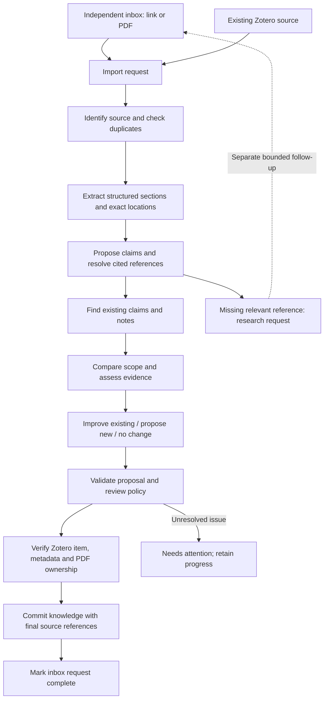
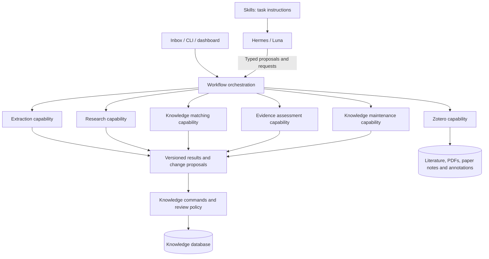
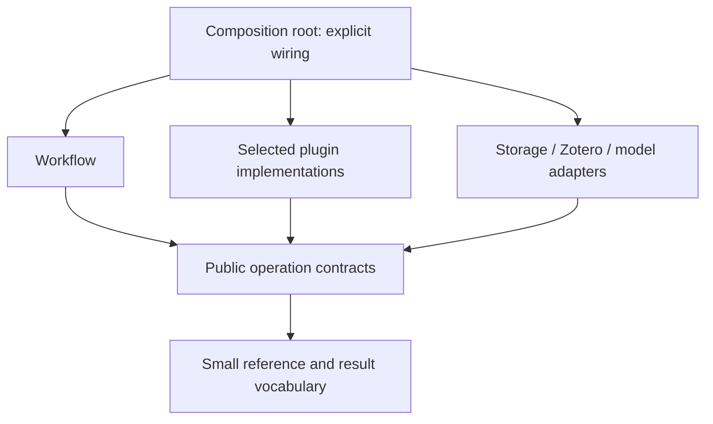

# Modular research architecture and source workflows

The [Hermes integration target](hermes-integration-target.md), requested on
2026-09-16, takes precedence for agent execution, task ownership and extension
packaging. Reuse native Hermes runs, tasks, schedules, plugins and skills;
Knowledge keeps its domain operations and deterministic processing. This is a
target decision, not a claim of installed or deployed integration.

Decision date: 2026-09-15. Status: approved architectural direction, not a
completed plugin implementation. This document owns the two entry paths,
module boundaries and replacement rules. It supersedes the earlier assumption
that every incoming source must already be in Zotero.

The [source-view specification](knowledge-source-view.md) remains authoritative
for presentation and structured source content. The
[extraction specification](knowledge-extraction.md) owns extraction methods and
jobs. The [implemented contracts](knowledge-contracts.md) remain the migration
baseline. This document adds no runtime, dependency, service or code scaffold.

The [structured knowledge and authoring plan](knowledge-structure-and-quality.md)
extends this workflow with research-question relevance, explicit database
schemas, document citations, derived graph/vector indexes and author-rule
evaluation. These are approved next steps, not deployed capabilities. It owns
those decisions where earlier prose implies Markdown-only structure or one
generated entry per source.

## 1. Purpose and current boundary

The [Zotero ownership decision](knowledge-zotero-ownership.md) extends the
literature boundary to paper summaries, annotations and literature organization.
Use its typed items, child objects and stable references as modelling
principles;
do not reproduce Zotero's internal schema or create a second literature catalog.

Build independent capabilities around a small knowledge application. A module
must be understandable, testable and replaceable without knowing every research
workflow. Prefer improving existing knowledge over producing one note per file.

The pilot already has Zotero ownership, revisioned records, contribution
reconciliation, evidence checks and note consolidation. Its package structure
now exposes those module boundaries, but it is not yet an isolated plugin
system: source-processing workflows import concrete knowledge-base and
revision-store classes, `source_workflows/source_import.py` calls
`source_workflows/claim_reconciliation.py` directly, and handlers in
`web_interface/fastapi_app.py` read the revision store. These are observed
migration seams, not proof of enforced isolation. Private pilot experiments
informed this target. They are not distributed as reproducible public
acceptance evidence.

## 2. Two entry paths, one processing workflow

The independent inbox accepts a link or PDF and an optional user summary. The
second path selects a source already held in Zotero. Both produce an import
request. Normal processing runs in the background without asking the user to
start each individual step. Uncertainty and protected edits require attention.

Broad discovery precedes selection when needed: a search result is not
automatically a Zotero item or a knowledge contribution. Associate selected
sources and knowledge with a research question and a contextual relevance
rationale. Keep personal reading distinct from machine processing. The workflow
below starts with an explicit intake; it does not import every landscape result.



An inbox summary is user context, not evidence for the source's findings.
Preserve original reading order, qualification and attribution when dividing a
source into meaningful sections. Reading a citation to another work does not
mean reading that work: retain secondary attribution until its original is
retrieved and checked. Similarity never establishes claim equivalence.

The inbox owns temporary inputs and processing state, not a literature catalog.
During preparation, proposals use an intake ID, input hash and extraction
snapshot ID. Before canonical acceptance, bind these to the verified Zotero
source and snapshot references. Do not create an editable source catalog merely
to obtain an early ID. Already catalogued sources reuse their existing identity.

Metadata is checked against the actual document version and verified lookup
results. Unknown fields stay unknown; conflicting metadata needs attention.
A missing field must not be fabricated to make an import appear complete.

Missing references enter a bounded follow-up queue, not recursive automatic
retrieval of every cited paper. Deduplicate requests by resolved identity,
retain unresolved ambiguity and record their parent request and relevance.
Budgets and stopping rules belong to the workflow, not to each source's text.

## 3. Separate orchestration, skills and plugin capabilities

- A **domain module** packages one coherent capability and its public operations.
  A Hermes plugin exposes selected operations and skills to the host; this
  document does not require a separate plugin framework or one plugin per module.
- A **skill** describes when and how Hermes uses those operations. It owns no
  tables, credentials, permissions or scientific acceptance decisions.
- **Hermes/Luna** produces language-dependent proposals using bounded inputs.
- **Workflow orchestration** uses Hermes for general agent tasks and schedules.
  Knowledge retains deterministic processing steps, extraction jobs and domain
  progress; it does not introduce another general agent controller.
- The **knowledge core** accepts domain commands, validates references and
  expected revisions, and persists attributed changes and review decisions.



The diagram describes orchestration, not imports between plugin implementations.
A deterministic extraction function needs no model. A semantic capability can
use an explicitly supplied model interface; it must not construct another agent
loop or import Hermes internals. Initial workflows are explicit Python
functions,
not a generic workflow language or autonomous planner.

## 4. Ownership and public boundaries

Operation names below are contract candidates, not implemented HTTP routes.

| Module | Public outcome | Must not own |
| --- | --- | --- |
| Inbox | Intake reference and request status | Permanent PDF/catalog copies |
| Workflow | Progress, retries and step results | Scientific judgments |
| Zotero | Literature and reading workspace | Cross-source knowledge |
| Extraction | Structured snapshot, locators and quality issues | Claim truth |
| Research | Source candidates and search coverage | Knowledge acceptance |
| Matching | Candidate IDs and reuse/new/skip proposals | Direct record writes |
| Evidence assessment | Appraisals and assessment proposals | Wiki prose |
| Knowledge maintenance | Note changes and diff | Invented evidence |
| Knowledge core | Commands and immutable revisions | Research providers |
| Presentation | Composed read views and review forms | New canonical records |

Each capability owns its input/output schema and validation. A small shared
contract vocabulary contains references, revision semantics and operation
outcomes. Do not place every domain model in a universal shared kernel.
Scientific policies remain in their owning domain; the core is not a generic
arbitrary-record mutation endpoint.

One database can hold canonical knowledge and workflow state with distinct
owners. Plugin caches are rebuildable and cannot become alternative records.
Existing Open Research Lab research databases remain separate project artifacts;
they must not become a second authority for accepted claims in this system.

## 5. Contracts before integration

| Contract | Minimum information |
| --- | --- |
| Import request | Intake/Zotero reference, input hash, scope, request ID |
| Source reference | Zotero instance/library/item, attachment and PDF hash |
| Extraction snapshot | Input version, method, blocks, locators, quality |
| Knowledge contribution | Scoped proposition, source spans, attribution |
| Candidate packet | Supplied record revisions, selection and coverage |
| Match proposal | Candidate or new/skip, relation, rationale, uncertainty |
| Assessment proposal | Complete evidence references, balance and limits |
| Change proposal | Target, expected revision, changes, rationale, citations |
| Operation result | Version, request identity, outcome, outputs and issues |

Before implementing an operation, specify its preconditions, input and output
schemas, permitted side effects, relevant limits, error behavior and retry
semantics. Use concrete Pydantic models for actual integrations; no untyped
payload bag or universal command bus. Credentials never belong in these models.

Distinguish execution success, structural validity, scientific review and
publication permission. Empty useful output is success with no contribution;
failed or incomplete processing is not an empty successful result. A plugin
cannot grant itself permissions through its output or prompt.

Keep contract versions separate from plugin/model versions and record revisions.
An incompatible contract requires explicit consumer migration; do not silently
reinterpret an old payload. Compatible implementation changes must pass the
same behavioral contract tests. Reprocessing keeps its method/model provenance
and creates a new snapshot or proposal rather than rewriting cited history.

## 6. Dependency direction and replaceability



Arrows here mean allowed source-code dependencies. Contracts never import
implementations. The composition root is the one place that chooses concrete
implementations and supplies their required interfaces.

Rules for new and migrated boundaries:

1. No plugin-to-plugin implementation imports, private helper imports or
   access to another module's tables. Pass results through orchestration.
2. Cross-module access uses a narrow public read/command contract. Do not pass
   an entire `Knowledge`, `Ledger`, connection or service locator to a plugin
   when it only needs candidate lookup or source bytes.
3. Core domain rules do not import web frameworks, provider clients, extraction
   libraries or Hermes. Adapters translate those systems at the edge.
4. A plugin declares only the capabilities it actually needs. Install, import
   and ordinary reads must not start model calls, downloads or background jobs.
5. Keep optional heavy runtimes behind extraction/transcription adapters.
   Removing one must not break review, source metadata reads or unrelated work.
6. Public contracts are the only supported dependency surface. Avoid cycles;
   do not solve one by moving unrelated business logic into a shared utilities
   package or by hiding dependencies in runtime imports.
7. Start with ordinary packages and explicit registration in one repository.
   No dynamic plugin discovery, plugin marketplace, event bus, separate service
   per module or independent dependency lockfile until a concrete need exists.

A Python package boundary provides maintainability, not a security sandbox.
Untrusted plugin execution would need an explicit process/security boundary;
this initial design supports trusted code only. Model-provided text remains
untrusted input regardless of plugin packaging.

A replacement is acceptable when the same contract tests pass, consumer code
needs only a wiring change, unrelated capabilities work with it absent, and its
old outputs and citations remain readable. Provider-specific errors must be
translated at that provider's boundary without losing actionable context.

## 7. Completion, retries and human intervention

```mermaid
sequenceDiagram
    participant I as Inbox
    participant W as Workflow
    participant P as Plugins
    participant Z as Zotero
    participant K as Knowledge core
    I->>W: Stable request and temporary input
    W->>P: Bounded processing steps
    P-->>W: Validated proposals and unresolved issues
    W->>Z: Reuse or import source; verify attachments
    Z-->>W: Final source references and confirmation
    W->>K: Apply allowed changes with expected revisions
    K-->>W: Atomic knowledge receipt
    W-->>I: Completion; staging eligible for cleanup
    Note over W,K: If acceptance fails, resume using the Zotero result
```

Zotero and PostgreSQL do not share an atomic transaction. Persist each confirmed
step and reconcile uncertain external writes before retrying. A failure after
Zotero import must not create another item; a stale note revision must produce
an explicit conflict and fresh proposal, not an overwrite.

Use stable request identities bound to input and processing versions. Hold no
database transaction during model, network or PDF processing. Keep completed
knowledge commands idempotent and preserve partial progress explicitly.

Automatic acceptance is allowed only by the configured domain policy, initially
for unreviewed model proposals. Human-authored or approved text needs a proposed
diff and a human decision. Source identity conflicts, inadequate extraction or
unsupported attribution retain an actionable issue rather than false completion.

Delete temporary inbox copies only after verified Zotero ownership and required
knowledge receipts. Keep rejected/unresolved requests inspectable according to
an explicit retention rule. Raw model inputs and technical recovery artifacts
are justified audit data, not a second maintained source library. Never delete
the user's original folder merely because a managed staging copy is complete.

## 8. Possible extensions from Open Research Lab

These are **optional future capabilities**, not implementation commitments.
The earlier design reviewed an external Open Research Lab checkout.
Existing code or skill availability does not mean deployment on the host.

| Possible extension | Existing basis | Integration boundary |
| --- | --- | --- |
| Scholarly discovery | OpenAlex, Crossref, ERIC adapters | Research results |
| Open-access lookup | Unpaywall locations and rights | Inbox intake |
| Source deduplication | DOI and title/year checks | Zotero identity lookup |
| Field framing | Landscape models and skills | Research brief |
| Search planning | Query compiler and attempt logs | Research request |
| Literature screening | Review and optional ASReview selection | Decisions |
| Citation networks | Expansion and graph metrics | Read analysis |
| Passage retrieval | SQLite FTS5/BM25 candidate index | Candidate packet |
| Literature roles | Reviewed role proposals | Research annotations |
| Publication | Paragraph evidence checks and exports | Reviewed content |
| Horizon scanning | Signal/baseline skills | Research workflow |
| Art/design research | Europeana and object skills | Provider adapter |
| Qualitative research | Coding/theme and transcript support | Separate scope |
| Transcription/diarization | Optional local runtimes | Extraction output |
| Knowledge status | Epistemic models and validation | Assessment proposal |

Reuse provider normalization and methodology selectively. Do not import the old
application wholesale, duplicate its SQLite persistence beside PostgreSQL, or
adopt its binary object store as another PDF library. Its source deduplication
does not establish semantic equivalence of claims.

FTS5/BM25 already exists in the old project; embeddings are not its deployed
replacement. A future PostgreSQL vector adapter must return the same candidate
contract and demonstrate useful retrieval. Similarity scores, citation counts
and centrality never become evidence quality or truth scores.

Research publication can consume accepted knowledge without editing its source
records. Qualitative/transcription extensions need their own consent and data
handling rules; enabling a skill does not authorize sending recordings to Luna.
New scholarly-status labels must map explicitly to current balance, confidence
and review dimensions instead of creating conflicting assessment systems.

## 9. Incremental implementation and verification

1. Specify the real inbox-to-extraction and Zotero-finalization contracts.
   Reuse the structured snapshot specified for the source view.
2. Implement one link/PDF intake and the existing-Zotero route through the same
   explicit workflow. Include interrupted import and duplicate retry cases.
3. Isolate extraction behind that contract. Change only its wiring when
   substituting its implementation; keep source navigation and citations valid.
4. Separate matching, assessment and note maintenance at their actual call
   boundaries. Reuse existing validation and remove superseded paths.
5. Add a research provider only when missing-source follow-up is exercised.
   Optional extensions remain absent from the default dependency graph.

The next knowledge-quality slice follows the
[ordered implementation plan](knowledge-structure-and-quality.md#7-incremental-implementation-plan):
specify typed metadata and relationship contracts, test a general claim against
precise evidence, then evaluate reusable Zettel with the author's author rules.
Document-citation analysis and embedding trials follow concrete research and
retrieval cases. They reuse existing storage and are not prerequisites for
improving the first texts.

Verify contracts with small fixtures and test doubles, plus a bounded end-to-end
case for both entry paths. Cover unavailable Zotero, changed PDFs, stale edits,
model-invalid output, duplicate requests and recovery after Zotero acceptance.
Use a focused import-boundary test when these packages exist; avoid a custom
architecture framework. Type checking alone does not enforce module isolation.

Keep the current deployed behavior documented until each replacement is tested
and deployed. A new directory name or diagram is not a completed separation of
concerns. This specification requires no broad rewrite before the next useful
vertical slice works.
