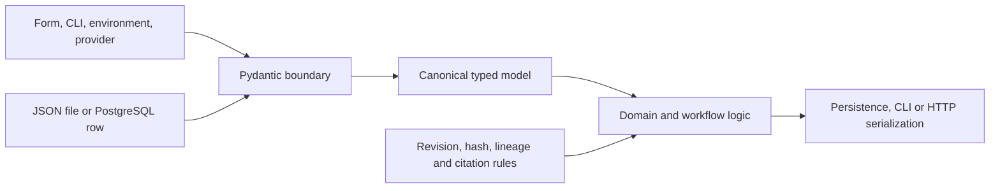
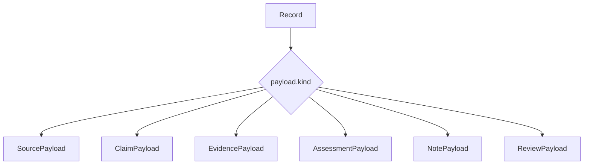
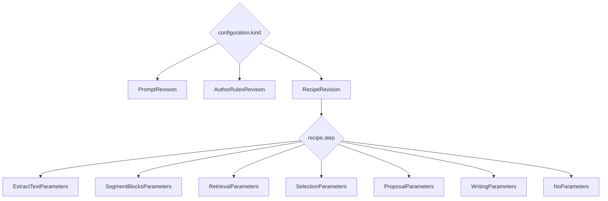
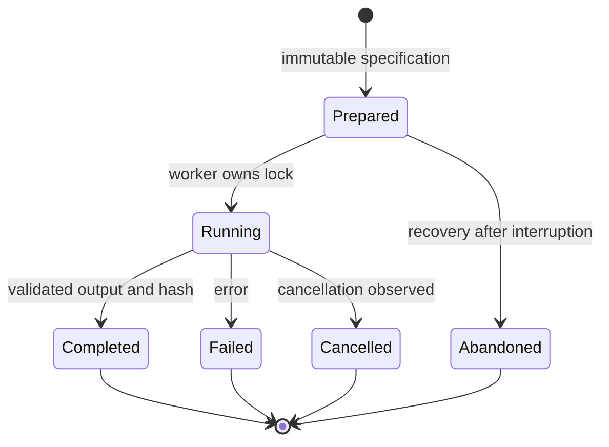
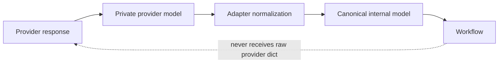

# Typed data architecture

Updated 2026-09-16. This is the binding architecture for data contracts in the
current refactor. The implementation-status table distinguishes completed work
from migrations that still require code or stored-data acceptance.

## One validation boundary

Every externally supplied or persisted document is validated exactly once when
it enters its owning module. Internal code retains the resulting canonical type.
Serialization happens only when data leaves through a database, file, command
line or HTTP boundary.

The concrete boundaries are the
[command interfaces](../src/knowledge/command_interfaces),
[web interface](../src/knowledge/web_interface),
[revision store](../src/knowledge/revision_store),
[experiment store](../src/knowledge/experiments/experiment_store.py) and the
provider adapters in [literature](../src/knowledge/literature) and
[document processing](../src/knowledge/document_processing).

Do not decode a document into a `dict`, validate individual pieces and then
rebuild the same contract. Use `model_validate_json()` for one model and a
reused `TypeAdapter` for a bare list, mapping or union.

## Simplification mandate

Pydantic is not an additional abstraction layer. It replaces parallel data
representations, manual shape validation and repeated serialization logic. A
refactor is only a simplification when the canonical model removes more
dictionary plumbing, validators, compatibility branches and helper code than it
introduces.

All durable or module-spanning application data belongs to one of five concepts:

1. `Record` represents revisioned domain knowledge.
2. `ConfigurationRevision` represents one immutable typed configuration.
3. `ExperimentManifest` represents one isolated experiment.
4. `AttemptSpecification` represents one immutable execution request.
5. `AttemptResult` represents one terminal outcome.

Concrete domain payloads and step configurations are discriminated variants of
these concepts, not additional generic envelopes. External provider formats are
temporary adapter inputs and must not become a second internal representation.

The following are architecture violations:

- passing an unvalidated provider or persisted `dict` across a module boundary;
- storing the same discriminator independently in an envelope and its payload;
- parsing JSON into a dictionary before validating a model that can validate the
  JSON directly;
- validating the same document again in downstream workflow steps;
- keeping both legacy and canonical readers after a migration is complete;
- adding a wrapper, validator framework or service layer when Pydantic or an
  installed library already provides the required operation;
- introducing more permanent infrastructure than the old validation and
  compatibility code being removed.

## Model policies and field types

There are only two general schema policies:

1. Application-owned schemas reject unknown fields and are immutable after
   construction (`extra="forbid"`, `frozen=True`). This covers stored and
   module-spanning contracts.
2. External provider payloads ignore unknown fields (`extra="ignore"`) so a
   compatible provider extension does not break the adapter. Provider models
   remain private to that adapter.

Environment configuration is a separate concern and uses `BaseSettings`.
Dataclasses remain appropriate for trusted runtime context containing callables,
open resources or process-local state.

Reusable `Annotated` field types own recurring scalar constraints. The target
set includes positive revisions and page numbers, SHA-256 values, experiment
identifiers, normalized nonempty text and exact source text. Exact quotations,
PDF pages and character-offset text must never inherit automatic whitespace
normalization. These field types belong beside the application-owned base model,
not in additional inheritance layers.

## Canonical records

The target record stores the discriminator once, inside its payload. `Record`
contains a discriminated payload union and exposes the kind as a derived value.
It does not persist a second independent `kind` value.

The current implementation in
[knowledge_record_models.py](../src/knowledge/knowledge_domain/knowledge_record_models.py)
still has both `Record.kind` and an untagged payload union. The migration must
update PostgreSQL rows and readers together, remove `PAYLOAD_TYPES` and
`decode_payload`, and only then remove the old representation. Historical source
records must be migrated through the existing
[Zotero source migration](../src/knowledge/system_maintenance/zotero_source_migration.py)
before `LegacySource` is deleted. Storage format changes receive an explicit
schema or document version; they do not create permanent dual readers.

## Typed configuration

Configuration revisions form a discriminated union on `kind`. Recipe content is
then discriminated on `step`; each step owns one parameter model. There is no
generic `ConfigRevision.payload`, generic `Recipe.parameters`, parallel allowed
parameter list or second imperative parameter validator.

The owning boundary is
[prompt_registry.py](../src/knowledge/model_integration/prompt_registry.py).
The [step catalog](../src/knowledge/experiments/experiment_step_catalog.py)
selects behavior; it must not duplicate the parameter schema.

## Experiment lifecycle

An experiment consists of an immutable manifest and knowledge snapshot. An
attempt has one immutable specification and at most one terminal result selected
by a `status` discriminator. Runtime execution state exists only when recovery
requires durable information; file presence, an operating-system lock and the
worker process should not be mirrored by unnecessary status documents.

The current persisted models live in
[experiment_models.py](../src/knowledge/experiments/experiment_models.py), with
orchestration in
[experiment_runner.py](../src/knowledge/experiments/experiment_runner.py).
`StepExecution` remains a dataclass for runtime resources, but its generic
`inputs` mapping is temporary. The runner must load each dependency once and
call an executor with explicit typed inputs; step functions must not revalidate
the same dictionaries.

## Adapter boundaries

Zotero, Crossref, GROBID, Docling, Marker and Hermes formats exist only inside
their respective adapters. Each adapter validates the provider subset it uses,
performs provider-specific normalization and returns a canonical internal model.

The boundaries are
[zotero_client.py](../src/knowledge/literature/zotero_client.py),
[crossref_client.py](../src/knowledge/literature/crossref_client.py),
[grobid_client.py](../src/knowledge/literature/grobid_client.py),
[docling_parser.py](../src/knowledge/document_processing/docling_parser.py),
[marker_parser.py](../src/knowledge/document_processing/marker_parser.py) and
[hermes_bridge.py](../src/knowledge/model_integration/hermes_bridge.py).
Bibliographic data is normalized to one canonical `BibliographicMetadata`
contract before leaving these adapters.

## Deliberately outside Pydantic

Pydantic owns data shape and intrinsic invariants. The following require runtime
or external context and remain explicit functions:

- optimistic revisions, transactions and idempotency;
- canonical hashes and comparisons against pinned bytes;
- attempt lineage and stale-input detection;
- file size, PDF header, path ownership and attachment existence;
- exact quotation, citation, candidate and source-span verification;
- timeout, cancellation, process and operating-system lock handling.

Local template dictionaries are presentation values, not reusable contracts.
Stateful parsers may use mutable builders internally, but must emit a validated
immutable model at their boundary.

## Storage, schemas and migration

Existing storage is migrated in bounded versions. A reader for the new version
is introduced with its migration, existing data is verified, and obsolete code
is removed in the same migration unit. Do not retain an indefinite fallback
reader or introduce a new `Legacy*` type.

Hash inputs remain explicitly canonicalized. `model_dump_json()` is not a
replacement for the repository's sorted canonical hash representation. Model
class names, field names, field constraints and model docstrings can change
`model_json_schema()`. Experiment output schemas and model-request identities
include those schemas, so such edits deliberately invalidate affected prepared
attempts or caches and require a versioned compatibility decision.

## Iterative implementation method

Each migration is implemented as a small vertical slice. Before changing code,
read the current official documentation for Pydantic, FastAPI and any affected
library, then inspect existing project utilities and installed dependencies.
Prefer, in order: existing project code, an extension of existing code, the
standard library, an installed dependency and a documented library feature.
Custom parsing, validation infrastructure or wrappers are the final option.

For every slice:

1. identify one current boundary and its duplicate representations;
2. introduce or reuse the canonical Pydantic contract at the owning boundary;
3. migrate every caller to retain that typed value;
4. delete the replaced dictionaries, casts, validators and compatibility paths;
5. verify stored JSON, canonical hashes and generated JSON Schema;
6. run formatting, linting, type checks and focused tests;
7. update this document and the implementation-status table.

A temporary compatibility path is allowed only inside the migration that removes
it. Stored data is migrated and verified before the old reader is deleted.
Changes should normally remove more executable code than they add. If a slice
adds significant infrastructure without deleting an existing representation or
validation path, reconsider the design before continuing.

## Implementation status

| Area | Status |
| --- | --- |
| Direct validation of import and consolidation JSON | Implemented in the current refactor |
| Typed experiment knowledge snapshot and CLI JSON | Implemented in the current refactor |
| Shared application/provider model policies and scalar field types | Pending |
| Canonical record discriminator and PostgreSQL migration | Pending data access and migration |
| Typed configuration and step parameters | Pending |
| Immutable attempt specification and terminal result union | Pending |
| Explicit typed step inputs | Pending |
| Canonical bibliography and private provider DTOs | Pending |
| Central `BaseSettings` configuration | Server paths implemented; provider/tool settings pending |

## Architecture checklist

Every data-contract change must answer these questions in review:

- Does this create a second representation of an existing concept?
- Can a raw provider `dict` leave its adapter?
- Is already validated JSON parsed or validated again downstream?
- Can a reusable `TypeAdapter` replace a wrapper model for a list, mapping or union?
- Is this model stored or shared across modules, or would a dataclass/local value suffice?
- Does the change preserve exact source text and existing canonical hash inputs?
- Does it remove more validation, dictionary plumbing and special cases than it adds?
- Does a storage or JSON Schema change have an explicit version and migration path?
